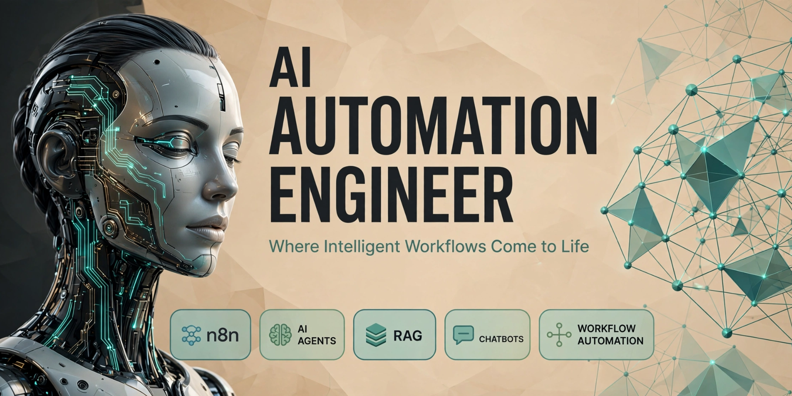
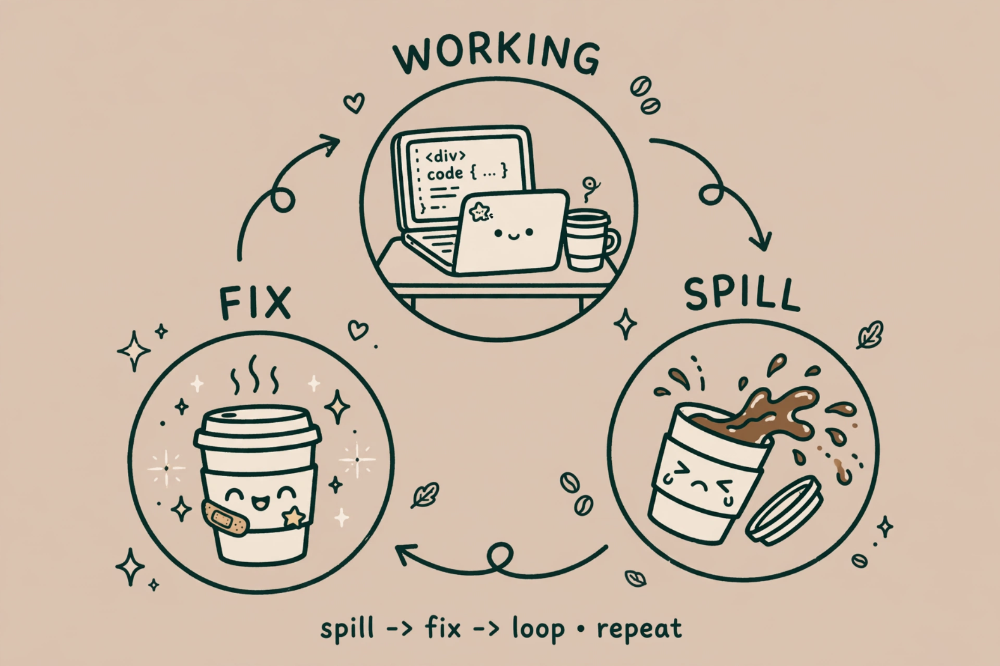

  

  

<h1 align="center">Hi 👋, I'm Amber Shahid</h1>
<h3 align="center">AI Automation Engineer from Bahawalpur, Pakistan</h3>

---

### ✨ About Me

**🎓 BS Artificial Intelligence Student at The Islamia University of Bahawalpur**

I am an AI Automation Engineer.I have built workflow automations on n8n that automate daily business operations
**🔧 What I have worked on:**
- **AI Automation & n8n** - I have built complex workflow automations on n8n
- **Websites & Lovable AI** - I have built modern websites using Lovable AI
- **RAG Systems & AI Agents** - I have built intelligent AI agents that connect to your own data
- **Prompt Engineering** - Professional prompt engineering to get the best results
- **Chatbots** - Smart chatbots that actually get the work done

**🎯 My Goal:** Less Manual Work, More Smart Automation - Where Intelligent Workflows Come to Life.

  

  <em>spill -> fix -> loop • repeat - My daily debugging life ☕</em>

---

### 🛠️ My Tech Stack

### 📫 Connect With Me

### 🤖 AI & Automation

  <table>
    <tr>
      <td align="center" width="120">
         
        <b>n8n</b>
      </td>
      <td align="center" width="120">
         
        <b>AI Agents</b>
      </td>
      <td align="center" width="120">
         
        <b>RAG Agents</b>
      </td>
    </tr>
  </table>

### ⚡ Workflow Automation

  <table>
    <tr>
      <td align="center" width="140">
         
        <b>n8n Expert</b>
      </td>
      <td align="center" width="140">
         
        <b>CRM Automation</b>
      </td>
      <td align="center" width="140">
         
        <b>AI Agent Workflows</b>
      </td>
    </tr>
  </table>

### 💻 Programming Languages

  <table>
    <tr>
      <td align="center" width="100"> <b>Python</b></td>
      <td align="center" width="100"> <b>C</b></td>
      <td align="center" width="100"> <b>C++</b></td>
      <td align="center" width="100"> <b>Dart</b></td>
      <td align="center" width="100"> <b>HTML5</b></td>
    </tr>
  </table>

### 🗄️ Databases

  <table>
    <tr>
      <td align="center" width="120"> <b>MySQL</b></td>
      <td align="center" width="120"> <b>PostgreSQL</b></td>
    </tr>
  </table>

### ⚡ My Build Log

  

---

### 🤖 My Automation Philosophy

> *"I don't just build AI that talks — I build automation that works. Less manual clicks, more smart workflows."*

